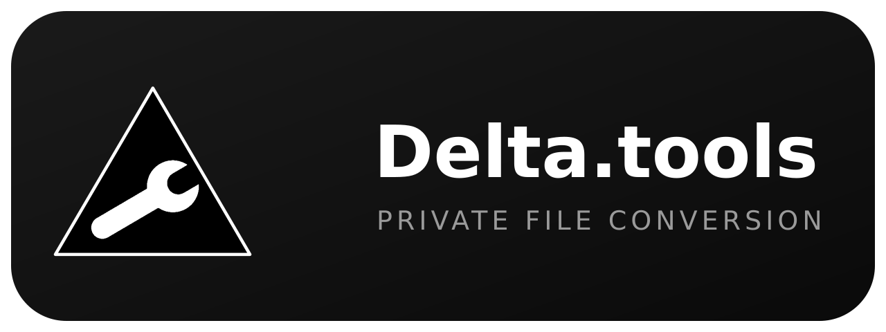

<p align="center">
  
</p>

<p align="center">
  <b>Private, trustable, and completely client-side file conversion</b><br/>
  Simple, lightweight, and open source — no ads, no spyware, no tracking
</p>

<p align="center">
  
  
  
  
  
  
  
</p>

## ✨ What is Delta.tools?

**Delta.tools** is a file conversion platform that runs 100% in your browser.

Every conversion happens client-side — your files never leave your machine. No uploads, no servers peeking at your data, no waiting for an external service.

💡 Ideal for anyone who wants a free, private, and ad-free alternative to online converters.

---

## 🚀 Features

- 🔒 100% in-browser conversions — files never leave your machine
- 🖼️ Images — PNG, JPG, WEBP, BMP, ICO, AVIF, GIF
- 🎵 Audio — MP3, WAV, OGG, FLAC, AAC, M4A, OPUS
- 🎬 Video — MP4, WebM, MOV, MKV, AVI + GIF export + audio extraction
- 📄 Documents — PDF → images, images → PDF, PDF merge, PDF compress
- 🗜️ Archives — ZIP, TAR, GZ conversions
- 📝 Text — JSON pretty, CSV ⇄ JSON, base64 decode
- 🧩 Sandboxed plugin marketplace — install community converters in one click
- ⭐ Account favorites — star your tools and keep them synced (JWT auth)
- 🌙 Dark, minimal UI — straight from your Figma design

---

## 🧠 How it works

```
You pick a file
↓
Delta.tools processes it in your browser
↓
Runs the conversion (Canvas, ffmpeg.wasm, pdf-lib, fflate)
↓
You download the result
↓
Nothing was ever uploaded
```

---

## 📁 Project structure

```
delta.tools/
├── web/                 # Browser app (Vite + TypeScript)
│   └── src/
│       ├── converters/  # image · media (ffmpeg.wasm) · pdf · archive · text
│       ├── plugins/     # sandboxed plugin runtime + IndexedDB store
│       ├── ui/          # icons, toast, sidebar shell
│       └── views/       # dashboard · tool · marketplace · tools · auth · settings
├── server/              # Account + marketplace API (Express + node:sqlite)
│   ├── src/routes/      # auth · plugins · favorites
│   └── .env.example     # JWT secret template
├── assets/              # Logos and visual resources
├── tests/               # Playwright end-to-end smoke tests
└── docs/                # Plugin authoring guide
```

---

## 📦 Installation

### 1. Setup Environment

Ensure you have **Node.js 20+** installed (for `node:sqlite`):

```bash
git clone https://github.com/bryanrafaelbueno/delta.tools
cd delta.tools
npm install
```

### 2. Configure the server environment

```bash
cp server/.env.example server/.env
```

Open `server/.env` and set a strong `JWT_SECRET` — this key signs the login tokens, so keep it private:

```env
JWT_SECRET=change-me-to-a-long-random-string
```

### 3. Run in Development Mode

```bash
npm run dev
```

| Service | URL |
| --- | --- |
| 🌐 Web app | http://localhost:5173 |
| ⚙️ API server | http://localhost:3001 |

### Production

```bash
npm run build
npm start        # serves the built web app + API on :3001
```

### 4. Setup your workspace

1. **Search** — type a tool name in the hero search (e.g. `wav`, `pdf`)
2. **Convert** — drop your file and download the result
3. **Star** — favorite the tools you use most; they stay in your sidebar

---

## 🖥️ Interface

Run `npm run dev` and open http://localhost:5173 — the dashboard is a clean
centered search over 136 built-in converters, with favorites and the plugin
marketplace one click away.

---

## ⚙️ Configuration

### Authentication (JWT)

Delta.tools uses **JWT (HS256)** for accounts:

- On login/register the server returns a signed JWT (`30-day` expiry) with the user id in the payload.
- The client stores the token in `localStorage` (`delta_token`), so you stay signed in across reloads.
- Every authenticated request sends `Authorization: Bearer <token>`; the server verifies the signature with `JWT_SECRET` from `server/.env`.
- Sessions are **stateless** — no session table, no server-side state.

### Server environment (`server/.env`)

| Variable | Description |
| --- | --- |
| `JWT_SECRET` | HMAC key used to sign login tokens. **Keep it private.** |

### Cross-origin isolation

ffmpeg.wasm requires `SharedArrayBuffer`, so both the dev server and the
production server send `COOP: same-origin` and `COEP: require-corp` headers.

---

## 🧩 Plugin development

Plugins run in a **sandboxed iframe** (`sandbox="allow-scripts"` only): opaque
origin, no network, no cookies, no access to the parent page. Files move
through `postMessage` as `ArrayBuffer`s, and installed plugins live in
IndexedDB on your device.

See [docs/PLUGIN_API.md](docs/PLUGIN_API.md) for the full authoring guide,
plus example plugins seeded into the marketplace (`server/src/seed.js`).

---

## 🛠️ CLI

```bash
npm run dev        # start web + API with hot reload
npm run build      # typecheck + build the web app
npm start          # serve production build + API on :3001
```

---

## 🧱 Stack

* Frontend: TypeScript + Vite
* Converters: Canvas, ffmpeg.wasm, pdf-lib, pdfjs-dist, fflate
* Backend: Express + node:sqlite
* Auth: JWT (HS256, `node:crypto`)
* Testing: Playwright (e2e)

---

## 🤝 Contributing

1. Fork the project
2. Create your Feature Branch (`git checkout -b feature/AmazingFeature`)
3. Commit your changes (`git commit -m 'Add some AmazingFeature'`)
4. Push to the Branch (`git push origin feature/AmazingFeature`)
5. Open a Pull Request

---

## 🛠️ Developer Guide & Portability

### 1. Core Prerequisites

- **Node.js 20+** (required for `node:sqlite`)
- **npm** (ships with Node)

### 2. System Dependencies (Linux)

The web app itself needs nothing extra — all conversions are client-side.
If you are running the API server, SQLite is built into Node 20+.

### 3. Cross-platform

- **Linux/macOS/Windows**: fully supported (the API only needs Node).
- **Windows**: no special setup; run the same npm commands.

---

## 🏗️ Quick Setup Checklist

1. **Verify Environment**: `node --version` (must be 20+)
2. **Install Dependencies**: `npm install`
3. **Configure**: `cp server/.env.example server/.env` and set `JWT_SECRET`
4. **Run Dev Mode**: `npm run dev`
5. **Build Release**: `npm run build && npm start`

---

## 🧪 Running Tests

All test suites live in the repository and run exactly as CI does:

```bash
npm run dev -w server & npm run dev -w web &
npx playwright install chromium
node tests/e2e-smoke.cjs
```

This covers conversions (image, plugin), search navigation, marketplace
browsing, plugin install, auth, and theme toggling. See
[tests/README.md](tests/README.md).

---

## 📄 License

MIT © 2026 [Bryan Rafael](https://github.com/bryanrafaelbueno)

---

## ☕ Support the project
If this project helps you, consider supporting development: </br>
<a href="https://www.buymeacoffee.com/bryanrafaelbueno" target="_blank"></a> </br>

---
<p align="center">
<a href="https://feitonobrasil.dev.br" aria-label="Feito no Brasil">
  
</a>
</p>
